# 📊 DIAGRAMMES MERMAID - KBIS INTERNATIONAL

Ce fichier contient les diagrammes Mermaid pour visualiser la structure de la base de données.

## 🏗️ Diagramme de classes

```mermaid
classDiagram
    class Utilisateur {
        +id: AutoField
        +username: CharField
        +email: EmailField
        +first_name: CharField
        +last_name: CharField
        +telephone: CharField
        +groupe_travail: ForeignKey
        +actif: BooleanField
        +is_deleted: BooleanField
    }
    
    class GroupeTravail {
        +id: AutoField
        +nom: CharField
        +description: TextField
        +permissions: JSONField
        +actif: BooleanField
    }
    
    class Propriete {
        +id: AutoField
        +numero_propriete: CharField
        +adresse: TextField
        +ville: CharField
        +type_bien: ForeignKey
        +bailleur: ForeignKey
        +loyer_mensuel: CharField
        +charges_mensuelles: CharField
        +is_deleted: BooleanField
    }
    
    class Bailleur {
        +id: AutoField
        +numero_bailleur: CharField
        +civilite: CharField
        +nom: CharField
        +prenom: CharField
        +email: EmailField
        +telephone: CharField
        +is_deleted: BooleanField
    }
    
    class Locataire {
        +id: AutoField
        +numero_locataire: CharField
        +civilite: CharField
        +nom: CharField
        +prenom: CharField
        +email: EmailField
        +telephone: CharField
        +is_deleted: BooleanField
    }
    
    class TypeBien {
        +id: AutoField
        +nom: CharField
        +description: TextField
    }
    
    class Contrat {
        +id: AutoField
        +numero_contrat: CharField
        +propriete: ForeignKey
        +locataire: ForeignKey
        +date_debut: DateField
        +date_fin: DateField
        +loyer_mensuel: CharField
        +charges_mensuelles: CharField
        +depot_garantie: CharField
        +caution_payee: BooleanField
    }
    
    class Paiement {
        +id: AutoField
        +contrat: ForeignKey
        +montant: DecimalField
        +date_paiement: DateField
        +mode_paiement: CharField
        +statut: CharField
        +reference: CharField
    }
    
    class Quittance {
        +id: AutoField
        +contrat: ForeignKey
        +numero_quittance: CharField
        +periode_debut: DateField
        +periode_fin: DateField
        +montant_loyer: CharField
        +montant_charges: CharField
    }
    
    class NiveauAcces {
        +id: AutoField
        +nom: CharField
        +niveau: CharField
        +description: TextField
        +priorite: PositiveIntegerField
    }
    
    class AuditLog {
        +id: AutoField
        +utilisateur: ForeignKey
        +action: CharField
        +objet_type: CharField
        +objet_id: PositiveIntegerField
        +timestamp: DateTimeField
    }
    
    class Notification {
        +id: AutoField
        +utilisateur: ForeignKey
        +titre: CharField
        +message: TextField
        +type_notification: CharField
        +lu: BooleanField
        +date_creation: DateTimeField
    }
    
    %% Relations
    Utilisateur ||--o{ GroupeTravail : groupe_travail
    Propriete ||--o{ TypeBien : type_bien
    Propriete ||--o{ Bailleur : bailleur
    Contrat ||--o{ Propriete : propriete
    Contrat ||--o{ Locataire : locataire
    Paiement ||--o{ Contrat : contrat
    Quittance ||--o{ Contrat : contrat
    AuditLog ||--o{ Utilisateur : utilisateur
    Notification ||--o{ Utilisateur : utilisateur
```

## 👥 Diagramme de cas d'utilisation

```mermaid
graph TD
    Admin[👑 Administrateur]
    Caisse[💰 Caissier]
    Controle[🔍 Contrôleur]
    Privilege[⭐ Utilisateur Privilégié]
    
    subgraph "Gestion des Utilisateurs"
        CreerUtilisateur["Créer utilisateur"]
        ModifierUtilisateur["Modifier utilisateur"]
        SupprimerUtilisateur["Supprimer utilisateur"]
        GererGroupes["Gérer groupes"]
        AssignerPermissions["Assigner permissions"]
    end
    
    subgraph "Gestion Immobilière"
        CreerPropriete["Créer propriété"]
        ModifierPropriete["Modifier propriété"]
        SupprimerPropriete["Supprimer propriété"]
        GererBailleurs["Gérer bailleurs"]
        GererLocataires["Gérer locataires"]
        GererUnitesLocatives["Gérer unités locatives"]
    end
    
    subgraph "Gestion des Contrats"
        CreerContrat["Créer contrat"]
        ModifierContrat["Modifier contrat"]
        ResilierContrat["Résilier contrat"]
        GererQuittances["Gérer quittances"]
        GererEtatsLieux["Gérer états des lieux"]
    end
    
    subgraph "Gestion des Paiements"
        EnregistrerPaiement["Enregistrer paiement"]
        GenererRecu["Générer reçu"]
        GererRetraits["Gérer retraits"]
        PaiementsPartiels["Paiements partiels"]
        RapportsFinanciers["Rapports financiers"]
    end
    
    subgraph "Sécurité"
        SurveillerSecurite["Surveiller sécurité"]
        GererAlertes["Gérer alertes"]
        AuditActions["Audit des actions"]
    end
    
    %% Relations acteurs-cas d'utilisation
    Admin --> CreerUtilisateur
    Admin --> ModifierUtilisateur
    Admin --> SupprimerUtilisateur
    Admin --> GererGroupes
    Admin --> AssignerPermissions
    Admin --> SurveillerSecurite
    Admin --> GererAlertes
    Admin --> AuditActions
    
    Caisse --> EnregistrerPaiement
    Caisse --> GenererRecu
    Caisse --> GererRetraits
    Caisse --> PaiementsPartiels
    Caisse --> RapportsFinanciers
    
    Controle --> CreerPropriete
    Controle --> ModifierPropriete
    Controle --> GererBailleurs
    Controle --> GererLocataires
    Controle --> CreerContrat
    Controle --> ModifierContrat
    Controle --> GererQuittances
    Controle --> GererEtatsLieux
    
    Privilege --> CreerUtilisateur
    Privilege --> ModifierUtilisateur
    Privilege --> CreerPropriete
    Privilege --> ModifierPropriete
    Privilege --> CreerContrat
    Privilege --> ModifierContrat
    Privilege --> EnregistrerPaiement
    Privilege --> GenererRecu
    Privilege --> SurveillerSecurite
```



## 🔄 Diagramme de flux de données

```mermaid
flowchart TD
    A[Utilisateur] --> B[Système d'authentification]
    B --> C{Type d'utilisateur?}
    
    C -->|Administrateur| D[Panneau d'administration]
    C -->|Caissier| E[Module de paiements]
    C -->|Contrôleur| F[Module immobilier]
    C -->|Utilisateur privilégié| G[Accès étendu]
    
    D --> H[Gestion des utilisateurs]
    D --> I[Gestion des permissions]
    D --> J[Surveillance système]
    
    E --> K[Enregistrement paiements]
    E --> L[Génération reçus]
    E --> M[Gestion retraits]
    
    F --> N[Gestion propriétés]
    F --> O[Gestion contrats]
    F --> P[Gestion quittances]
    
    G --> Q[Accès multi-modules]
    Q --> R[Fonctionnalités avancées]
    
    H --> S[Base de données]
    I --> S
    J --> S
    K --> S
    L --> S
    M --> S
    N --> S
    O --> S
    P --> S
    R --> S
    
    S --> T[Audit et logs]
    T --> U[Notifications]
    U --> A
```



## 📊 Diagramme de relations de base de données

```mermaid
erDiagram
    UTILISATEUR ||--o{ GROUPE_TRAVAIL : "appartient à"
    UTILISATEUR ||--o{ AUDIT_LOG : "génère"
    UTILISATEUR ||--o{ NOTIFICATION : "reçoit"
    
    PROPRIETE ||--o{ TYPE_BIEN : "est de type"
    PROPRIETE ||--o{ BAILLEUR : "appartient à"
    PROPRIETE ||--o{ CONTRAT : "fait l'objet de"
    
    CONTRAT ||--o{ LOCATAIRE : "concerne"
    CONTRAT ||--o{ PAIEMENT : "génère"
    CONTRAT ||--o{ QUITTANCE : "produit"
    
    BAILLEUR ||--o{ PROPRIETE : "possède"
    LOCATAIRE ||--o{ CONTRAT : "signe"
    
    PAIEMENT ||--o{ RECU : "génère"
    
    UTILISATEUR {
        int id PK
        string username UK
        string email
        string first_name
        string last_name
        string telephone
        int groupe_travail_id FK
        boolean actif
        boolean is_deleted
    }
    
    PROPRIETE {
        int id PK
        string numero_propriete UK
        string adresse
        string ville
        int type_bien_id FK
        int bailleur_id FK
        string loyer_mensuel
        string charges_mensuelles
        boolean is_deleted
    }
    
    CONTRAT {
        int id PK
        string numero_contrat UK
        int propriete_id FK
        int locataire_id FK
        date date_debut
        date date_fin
        string loyer_mensuel
        string charges_mensuelles
        string depot_garantie
        boolean caution_payee
    }
    
    PAIEMENT {
        int id PK
        int contrat_id FK
        decimal montant
        date date_paiement
        string mode_paiement
        string statut
        string reference
    }
```



## 🎯 Diagramme de déploiement

```mermaid
graph TB
    subgraph "Environnement de développement"
        Dev[Serveur de développement]
        DevDB[(Base de données dev)]
        DevFiles[Fichiers de développement]
    end
    
    subgraph "Environnement de test"
        Test[Serveur de test]
        TestDB[(Base de données test)]
        TestFiles[Fichiers de test]
    end
    
    subgraph "Environnement de production"
        Prod[Serveur de production]
        ProdDB[(Base de données production)]
        ProdFiles[Fichiers de production]
        Backup[Backup automatique]
    end
    
    subgraph "Outils de déploiement"
        Git[Git Repository]
        CI[CI/CD Pipeline]
        Monitor[Monitoring]
    end
    
    Dev --> Test
    Test --> Prod
    
    Git --> Dev
    Git --> Test
    Git --> Prod
    
    CI --> Dev
    CI --> Test
    CI --> Prod
    
    Monitor --> Prod
    Monitor --> Test
    
    Prod --> Backup
```



---

*Diagrammes générés pour KBIS INTERNATIONAL - Gestion Immobilière*
