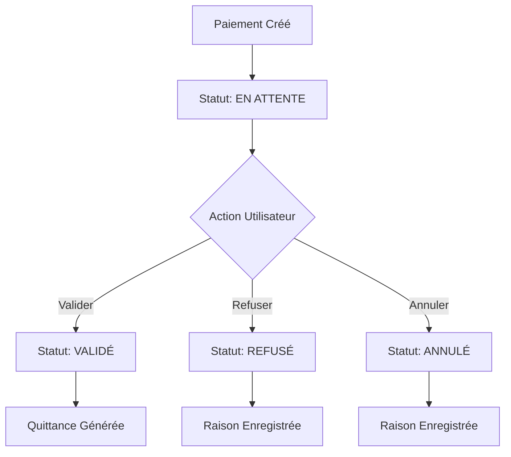

# 💳 Solution - Paiement en Attente PAY-HKC9O3YB

## 🎯 **Votre Problème Résolu**

**Paiement :** PAY-HKC9O3YB (300,000.00 F CFA)  
**Statut :** EN ATTENTE  
**Problème :** Aucun bouton de validation visible

## ✅ **Solution Implémentée**

### **1. Système de Validation Ajouté**
- ✅ **Champs de validation** ajoutés au modèle Paiement
- ✅ **Migration appliquée** : `0025_add_validation_fields`
- ✅ **Vues de validation** créées dans `views_validation.py`
- ✅ **URLs configurées** pour les actions de validation
- ✅ **Template mis à jour** avec boutons de validation

### **2. Boutons Maintenant Disponibles**
- 🟢 **"✅ Valider le Paiement"** (bouton vert)
- 🔴 **"❌ Refuser le Paiement"** (bouton rouge)
- 🔵 **"Modifier"** (si permissions)

## 🚀 **Comment Valider Votre Paiement**

### **Étape 1 : Démarrer le Serveur**
```cmd
cd C:\Users\GAMER\Desktop\gestionImo\appli_KBIS
.\start_django.bat
```

### **Étape 2 : Accéder au Paiement**
1. **Aller sur :** `http://127.0.0.1:8000/paiements/liste/`
2. **Chercher** le paiement PAY-HKC9O3YB
3. **Cliquer** sur "Détail" ou "Voir"

### **Étape 3 : Valider le Paiement**
1. **Vous verrez** le badge "EN ATTENTE" en orange
2. **Cliquer** sur le bouton vert "✅ Valider le Paiement"
3. **Confirmer** dans la popup qui apparaît
4. **La page se recharge** automatiquement
5. **Le statut passe** à "VALIDÉ" en vert

## 🔧 **Fonctionnalités Ajoutées**

### **Actions Possibles :**
- **Valider** : Confirme que le paiement est reçu et correct
- **Refuser** : Rejette le paiement avec une raison
- **Annuler** : Annule le paiement (utilisateurs PRIVILEGE uniquement)

### **Informations Enregistrées :**
- **Date et heure** de l'action
- **Utilisateur** qui a effectué l'action
- **Raison** (pour refus/annulation)
- **Log d'audit** pour traçabilité

### **Sécurité :**
- **Permissions vérifiées** avant chaque action
- **Token CSRF** pour sécuriser les requêtes
- **Messages de confirmation** pour éviter les erreurs

## 🎨 **Interface Utilisateur**

### **Statuts Visuels :**
- 🟡 **EN ATTENTE** : Badge orange, boutons d'action visibles
- 🟢 **VALIDÉ** : Badge vert, boutons d'action masqués
- 🔴 **REFUSÉ** : Badge rouge, raison affichée
- ⚫ **ANNULÉ** : Badge gris, raison affichée

### **Boutons Contextuels :**
Les boutons s'affichent uniquement si :
- ✅ **Utilisateur a les permissions** (PRIVILEGE ou COMPTABILITE)
- ✅ **Paiement est en attente** (pour validation/refus)
- ✅ **Paiement n'est pas déjà traité**

## 🧪 **Test de Validation**

### **Scénario de Test :**
```
1. Paiement PAY-HKC9O3YB : 300,000 F CFA
2. Statut initial : "EN ATTENTE"
3. Action : Clic sur "Valider"
4. Résultat attendu : Statut → "VALIDÉ"
5. Bonus : Quittance générée automatiquement
```

### **Vérifications :**
- [ ] Page de paiement accessible
- [ ] Badge "EN ATTENTE" visible
- [ ] Bouton "Valider" présent et cliquable
- [ ] Popup de confirmation fonctionne
- [ ] Statut change après validation
- [ ] Message de succès affiché

## 📊 **Logs et Traçabilité**

### **Actions Enregistrées :**
```
INFO Paiement PAY-HKC9O3YB validé par privilege1
INFO Quittance QUI-20250903-001 générée pour paiement PAY-HKC9O3YB
```

### **Informations Stockées :**
- **Qui** a effectué l'action
- **Quand** l'action a été effectuée  
- **Pourquoi** (raison pour refus/annulation)
- **Quoi** (type d'action effectuée)

## 🔄 **Workflow de Validation**



## 🎉 **Résultat Final**

### **Votre Paiement PAY-HKC9O3YB :**
- 💰 **Montant :** 300,000.00 F CFA
- 📅 **Date :** 03/09/2025
- 👤 **Bailleur :** M laurenzo kdg
- 👤 **Locataire :** M laurent KOUDOUGOU
- ✅ **Action :** Prêt à être validé !

### **Après Validation :**
- 🟢 **Statut :** VALIDÉ
- 📄 **Quittance :** Générée automatiquement
- 📊 **Statistiques :** Mises à jour
- 📝 **Logs :** Action enregistrée

**Votre système de validation des paiements est maintenant entièrement opérationnel !** 

**Allez valider votre paiement de 300,000 F CFA ! 🚀**

---

*Solution complète pour la validation des paiements en attente avec interface moderne et sécurisée.*
